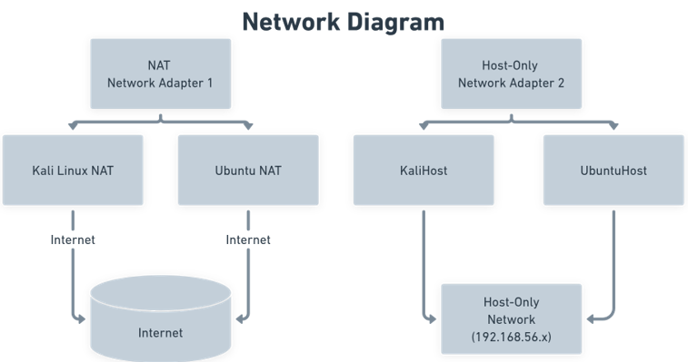
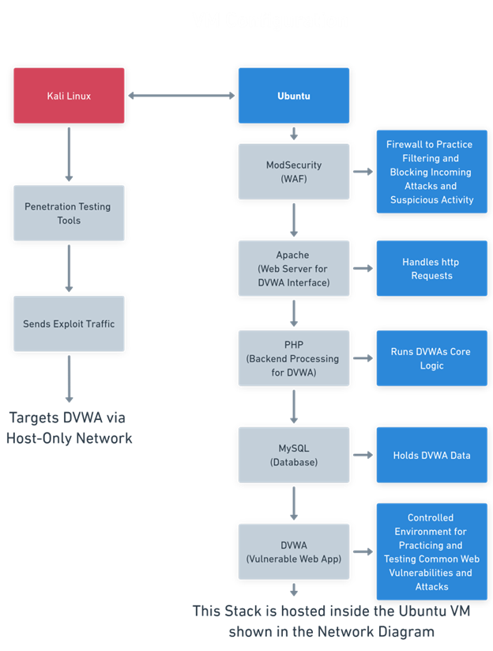

# HomeLab
Welcome to my HomeLab! This repository is to track and document the progress of my own HomeLab that I will use for cybersecurity and sysadmin practice. This will be done in a simulated and isolated environment with two Virtual Machines: Ubuntu (the defender) and Kali Linux (the attacker)

---

## Virtual Machine Setup

- **Attacker:** Kali Linux
- **Defender:** Ubuntu Linux

Each VM uses:
- **NAT Adapter** – Provides internet access.
- **Host-Only Adapter** – Enables internal communication between VMs on a private, isolated network.

Bridged mode was not possible due to Wi-Fi limitations in my apartment.

---

## Services on Ubuntu (Defender)

The Ubuntu VM runs the following stack to simulate vulnerable web applications:

- **Safeline** - Web Application Firewall
- **Apache** – Web server
- **PHP** – Backend processing
- **MySQL** – Database service
- **DVWA** – Damn Vulnerable Web Application

---

## Network & Traffic Flow

1. **Kali VM** attacks the **Ubuntu VM** via the Host-Only network.
2. **DVWA** is served on the Ubuntu machine using Safeline, Apache, and PHP, with data stored in MySQL.
3. Both VMs can access the internet via their NAT adapters (e.g., to install packages or tools).

---

### Web Application Firewall: SafeLine

To enhance the defensive capabilities of this HomeLab, SafeLine is installed on the Ubuntu (defender) VM as a web application firewall (WAF). Its purpose is to sit in front of DVWA and filter incoming HTTP traffic, providing real-time protection against common web-based attacks such as:

- SQL Injection (SQLi)
- Cross-Site Scripting (XSS)
- Command Injection
- Path Traversal

#### Configuration Overview

After allocating additional disk space to the Ubuntu VM, SafeLine was installed from the official package and configured to act as a reverse proxy in front of Apache. Apache was reconfigured to serve DVWA on an alternate port (8081), while SafeLine listens on port 80 and proxies valid requests internally.

This setup ensures that:
- All traffic to DVWA is first inspected and filtered by SafeLine
- Unsafe or malicious payloads are blocked before reaching the application
- Traffic between Kali (attacker) and DVWA is realistic and secure, simulating a real-world production firewall layer

SafeLine logs and responses will be used to analyze attack patterns and understand WAF rule behavior in response to different exploit attempts from the Kali VM.

---

## Network Diagram
This diagram shows the NAT and Host-Only adapter configuration between the Kali (attacker) and Ubuntu (defender) VMS.

---

## Flow Chart
This chart shows the services running inside the Ubuntu VM and how Kali interacts with DVWA.

--
