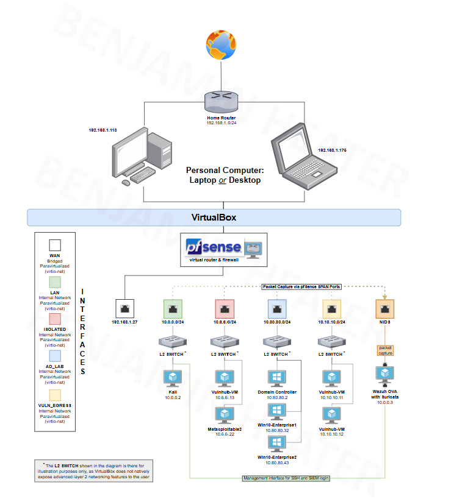

# Security Lab
Welcome to my Security Lab! All credits for the structure of this lab goes to 0xBen (https://benheater.com/). I'm using Ben Heaters guide for building this lab out in VirtualBox (Hypervisor). I am a beginner but I am hoping to gain experience with tools used in an enterprise environment. With this environment I will be able to practice penetration testing against a wide variety of targets, as well as detection in a SIEM. Within the lab all machines are run on private IP addresses only accesible from my network. You can read more about defined private IP addresses in the following documentation (RFC 1918): https://datatracker.ietf.org/doc/html/rfc1918

This is the link to the guide I will be Following https://benheater.com/building-a-security-lab-in-virtualbox/

## Flowchart


##  Lab Architecture 

The lab is built around a central **pfSense firewall** that acts as a router (NAT), segmenting traffic between multiple virtual networks. This design mimics a corporate environment, allowing for realistic attack and defense scenarios. All components are hosted within **VirtualBox** on a single machine.


### Core Component: pfSense Firewall

The pfSense VM is the heart of the lab. It connects to the physical home network via a **Bridged WAN interface** to get internet access and manages all internal lab traffic through several dedicated internal networks.

* **WAN Interface:** Connects to home network for internet access.
* **LAN Interface:** The primary internal network for attacker machines (Kali Linux)
* **ISOLATED VLAN, AD_LAB VLAN, VULN_EGRESS Interfaces:** Dedicated segments for specific functions, ensuring traffic from one lab segment doesn't spill into another.

### Core VM's
* pfSense - Router / firewall (manages lab networks and outbound access)

* Kali Linux - Offensive testing machine

* Ubuntu Server - General services / targets (optional)

* Metasploitable - Intentionally vulnerable box for exploit practice

* VulnHub-VM(s) - Extra vulnerable targets imported from VulnHub

* Windows 10 Enterprise1 & Enterprise2 - Windows clients for AD and endpoint work. Uses Domain controller for DHCP not the AD VLAN. 

* Domain Controller - Windows Server for Active Directory

* Wazuh (with Suricata) - SIEM + network IDS for detection and monitoring

---

### Network Segments 

Each network segment is configured as a separate vlan in VirtualBox and corresponds to a pfSense interface. This isolates traffic, which is a key security principle. Traffic that is not local from VM's will route requests to pfSense which will display our public WIFI's IP not the private IP's of the VM's/Devices themselves.

---

#### WAN Network

Attatched via a bridged adapter to provide an ethernet/wifi connection. This is the part of the lab that talks directly to the home network. This connection gives our lab internet access. (Except for our Isolated VM's as they are vulnerable and can be comprised which can result in a clear path to attack every other device connected to the home network)

---

####  LAN Network (`10.0.0.1/24`)
This network serves as the primary attacker/penetration tester
* **VMs on this network:**
    * `10.0.0.2` - **Kali Linux:** The primary offensive security machine.
 
This machine will attack our vulnerable targets on our Isolated Network 10.6.6.0/24. Firewall rules here prevent internet access. These machines are only allowed to communicate with Kali Linux(Attacker)

---

####  ISOLATED VLAN (`10.6.6.0/24`)
This is an isolated segment intended for specific experiments on different Vulnerable VM's
* **Purpose:** To host highly vulnerable machines in a contained environment.
* **VMs on this network:**
    * `10.6.6.13` - **Vulnhub-VM**  Think of this like an appstore for vulnerable VM'S. Contains hundreds of VM's each with unique pentesting challenges.
    * `10.6.6.22` - **Metasploitable2:** Intentionally vulnerable Linux VM used for penetration testing training. contains basic network pentesting and web application pentesting.

---

####  AD Lab VLAN (`10.80.80.0/24`)
This network simulates a corporate production environment containing core services like Active Directory and user workstations.

* **Purpose:** To practice setting up a basic AD forest. Configured to be vulnerable for attacks from Kali on our LAN network. 
* **VMs on this network:**
    * `10.80.80.2` - **Domain Controller:** A Windows Server VM running Active Directory Domain Services.
    * `10.80.80.32` - **Win10-Enterprise1** A Windows 10 client machine joined to the domain. 
    * `10.80.80.43` - **Win10-Enterprise2:** A Windows 10 client machine joined to the domain.

---
####  VULN_EGRESS VLAN (`10.10.10.0/24`)

This is a network added a bit later. This will show us how to configure additonal networks in VirtualBox and pfSense.

This network can be used for vulnerable hosts that...
* May access the Internet
* May NOT access any other private IP addresses

* **VMs on this network:**
* `10.10.10.11` More Vulnhub VM's
* `10.10.10.12` More Vulnhub VM's

---

####  SIEM + NIDS (`10.0.0.0/24`) - This portion is connected to our LAN 
Security Information and Event Management (Wazuh) + Network Intrusion Detection System (Suratica)
SIEM (Wazuh) is the central logging and analysis hub which collects alerts from Suratica (NIDS), along with logs from other VMs like our Windows Login events. This will help organize everything and allow us to search through data and create dashboards to help spot trends or active attacks. 

NIDS (Suratica) is the part that does real time analysis. It has a book of rules that describes what an attack looks like and can catch attacks in the act while providing us with alerts. This is the type of thing you'd see in a SOC where an analyst would check out the alert and respond accordingly. There is way to make automatic conditions as well. After experimenting I may venture into this realm. 

In order for our NIDS to see traffic from all our segmented VLANS (LAN, ISOLATED, AD_LAB, VULN_EGRESS) we will configure a SPAN port in pfSense. A SPAN port is like putting a "mirror" on your network switch. It takes a copy of every single packet from your other networks and forwards that copy to a specific interface on your Wazuh VM. This process is the packet capture. The NIDS then analyzes this mirrored traffic.

* **Purpose:** Defense, monitoring, and intrusion detection. This is the "Blue Team" headquarters.
* **VMs on this network:**
    * `10.0.0.3` - **Wazuh OVA with Suricata:** An all-in-one SIEM and Network Intrusion Detection System (NIDS). It collects logs and alerts on suspicious network traffic.
 
The Wazuh VM will have two network connections:

The Monitoring Interface: A dedicated network card that receives the mirrored traffic from the SPAN port. This interface just listens passively.

The Management Interface (10.0.0.3): This is connected to your LAN. Its only purpose is for you to connect to it from the Kali machine (at 10.0.0.2) to manage the system. This is where you'll use SSH or a web browser to log into the Wazuh SIEM, change settings, and view the alerts. It keeps the management traffic separate from the monitored traffic.

--- 

## Repo Structure 

```
/ (root) VirtualBox-Security-Lab
-- configs/        Stores exported configuration files (e.g., pfSense backup, VM settings).
-- docs/           Contains diagrams and other documentation. 
-- obsidian-notes/ Holds all markdown notes taken during the lab build-out and experiments.
README.md          This file, providing a high-level overview of the project.
.gitignore         Files to ignore (VM Disks, ISOs)
```
